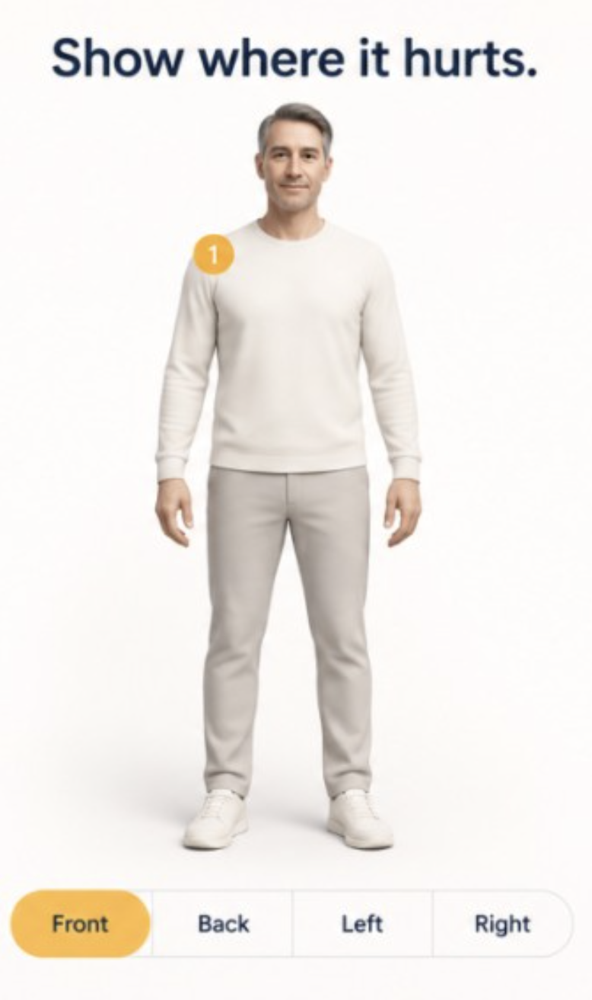

# Simple pain-map visual target

Reference mockup:

## Body assets

Patient simple-map uses the MetaHuman-style likeness pack:

`public/anatomy/metahuman/{adult-male,adult-female,teen,child,senior}/{front,back,left,right}.png`

Gallery thumbs: `public/anatomy/metahuman/thumbs/{model}.png`

Source sprite sheets: `docs/visual-targets/metahuman-sprites/`

Rebuild plates with `python3 scripts/build-metahuman-anatomy-pack.py`.

Clinician CAE plates under `public/anatomy/adult-male/` are unchanged.

## Locked color palette

| Token | Hex | Use |
| --- | --- | --- |
| Warm white | `#FEFBFA` | Page / stage background |
| Navy | `#182A42` | Text, brand, Save CTA |
| Amber | `#F9B847` | Selected chips, active view, slider, markers |
| Muted | `#A8AEB8` | Secondary labels |
| Border | `#D0D4DB` | Unselected controls |
